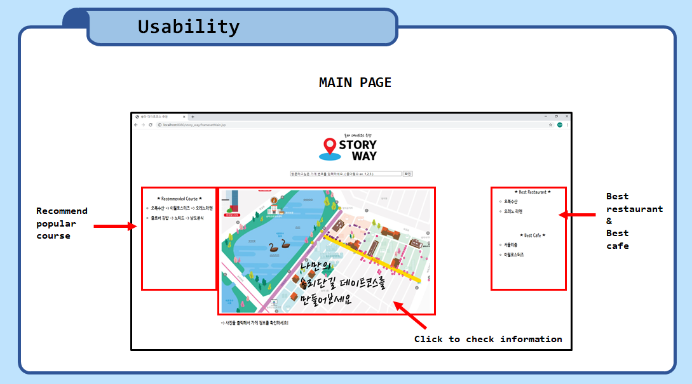

# StoryWay

> 2020 - 2학기 Algorithm Term Project  
> By using Java

## 용도

- 입력된 상점들을 돌아볼 수 있는 가장 좋은 경로를 출력

## 사용된 알고리즘

- Floyd-Washall
  - group으로 묶인 정점들을 이동하기 위한 인접행렬을 만드는 용도
- Backtracking
  - 가능한 모든 경로를 검색하는 데 사용
  - 더 이상 불가능한 경로라면 이후의 값을 탐색하지 않음

### 구조

#### Main

#### Algorithm

## HTML

- JSP를 사용하여 웹 브라우저에 화면을 띄움

### image

## Contributor

- 정재원 ([@Joe2357](https://github.com/Joe2357)) : 경로 도출 프로토타입 구현, 백엔드 구현
- 유지연 ([@yougi8](https://github.com/yougi8)) : jsp 제작, 프론트엔드 웹페이지 서버 구현
- 최완규 () : 웹페이지에 네이버지도 추가